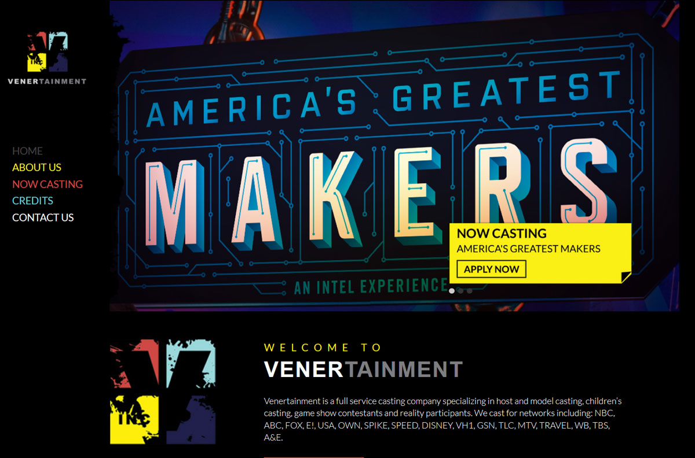
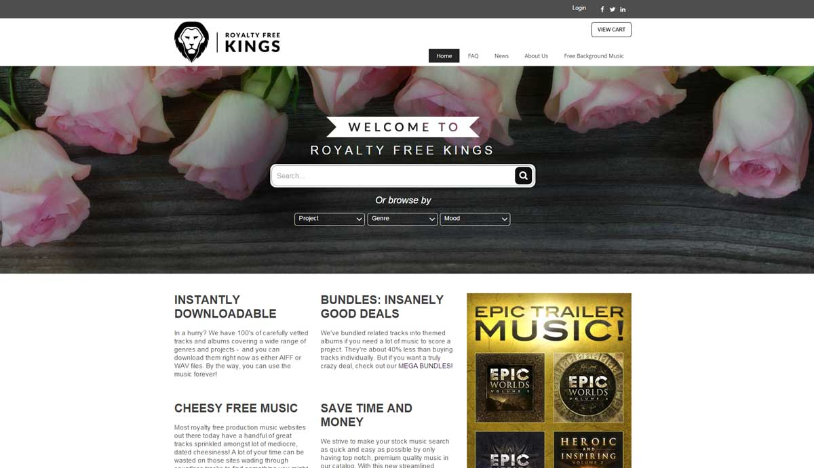
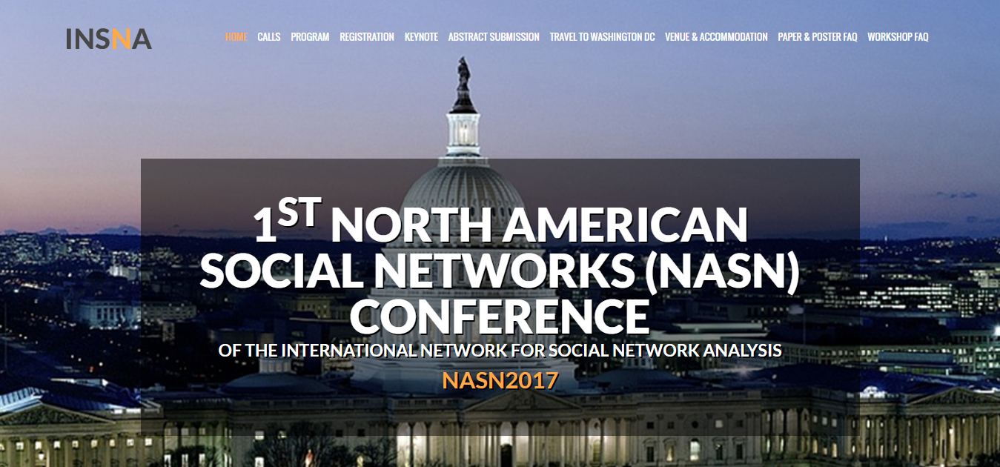
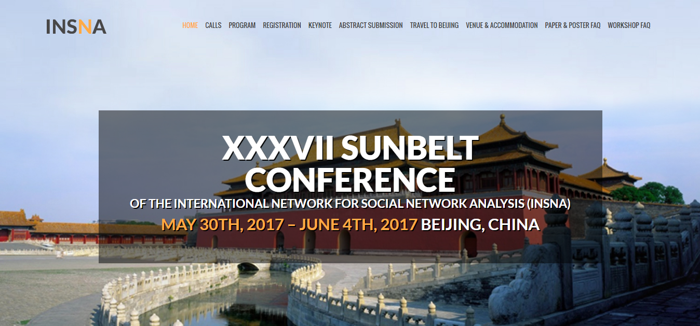
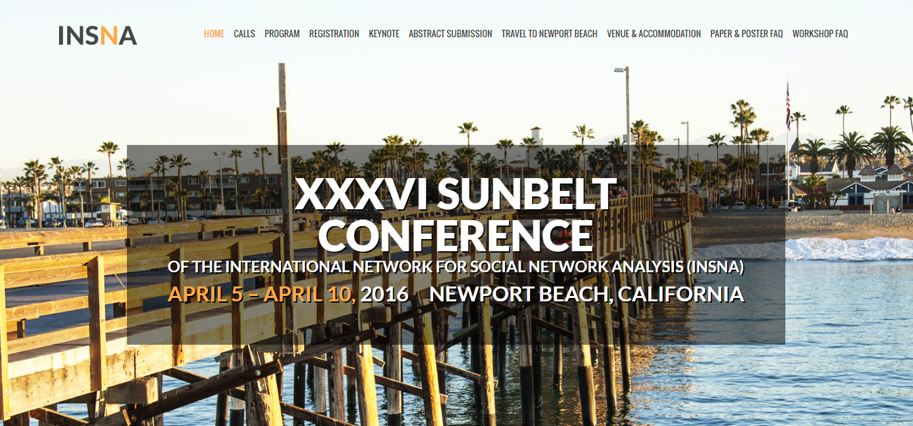
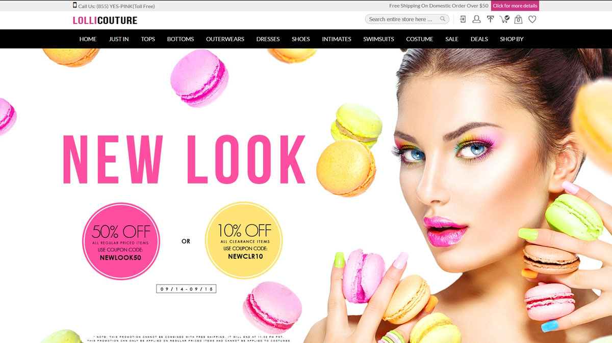
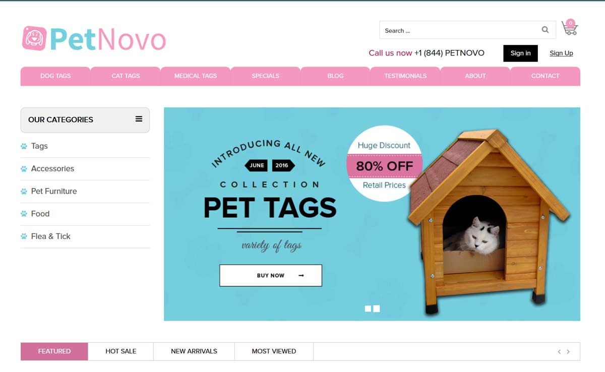
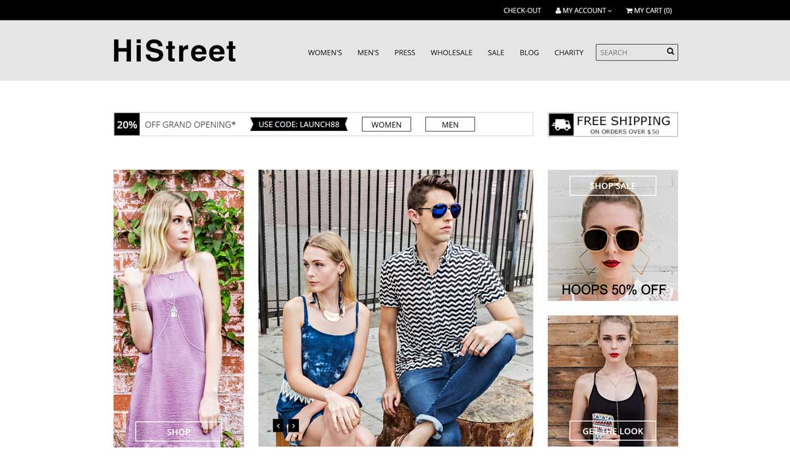
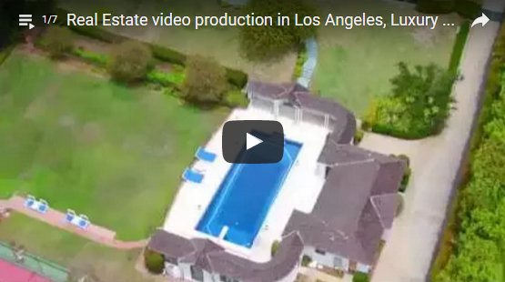

# Sunlight Media

Sunlight Media is a Los Angeles-based web design and internet marketing company, providing quality, stylish and affordable online solutions to a variety of local businesses, corporations, and government organizations. We specialize in custom web and e-commerce development utilizing a broad range of current and emerging web technologies, including WordPress, Joomla!, Magento, HTML5, Drupal, Flash, Zen Cart, CS Cart, Open Cart, custom PHP and custom mobile applications for both iOS and Android.
In addition to our web development, we provide logo design and company branding consultation, video production, product photography, internet marketing and SEO services.

For more information, please visit our [web design portfolio](https://sunlightmedia.org).

Below you can see design and development projects we have recently completed for a variety of eCommerce, Entertainment and Academic clients.

**Table of Contents**

* [Design & Development](https://sunlightmedia.org/services/web-design/)
  * Venertainment
  * RoyaltyFreeKings
  * INSNA
  * Lolli Couture
  * Pet Novo
  * Hi Street
* Logo Design
* Video Production
* Product Photography & Photoshop Retouching
* Contact

## Design & Development

### Venertainment

Venertainment is a full service casting company specializing in host and model casting, children’s casting, game show contestants and reality participants. They cast for networks including: NBC, ABC, FOX, E!, USA, OWN, SPIKE, SPEED, DISNEY, VH1, GSN, TLC, MTV, TRAVEL, WB, TBS, A&E.

When it was time to update their website, they reached out to Sunlight Media. We were delighted to provide [Venertainment ](http://venertainment.com/)with a custom WordPress solution that allows them to manage all casting applications and notices via their company website.

We provided an array of custom design options to eventually create a stunning, mobile friendly website that delivers cutting edge design with super fast load speeds.

### Royalty Free Kings

[RoyaltyFreeKings.com](https://www.royaltyfreekings.com/) was founded in 2009 and launched in 2012 by Los Angeles based composers Mark Petrie and Gina Brigida, and is today an international collaboration between composers and developers based all over the world. Some of those places include: Malibu – California, Nashville – Tennessee, Spain, New York City, Uruguay and Finland.

RFK hired Sunlight Media to develop a brand new custom website, with integration into the FastSpring digital content delivery platform. We used a custom PHP platform in order for our client to manage their webpages and media files, while FastSpring handles payment processing and file delivery.

### INSNA

INSNA, a division of USC Los Angeles, is the professional association for researchers and practitioners interested in social network analysis. It is a non-profit organization founded in 1977.

We have completed three different projects for the INSNA, [Sunbelt 2016](http://insna.org/sunbelt2016/), [NASN 2017](http://insna.org/nasn2017/), and [Sunbelt 2017](http://insna.org/sunbelt2017/). The Sunbelt 2016 conference took place April 5 – 10, 2016 in Newport Beach, CA, and the NASN 2017 and Sunbelt 2017 will be in Washington, D.C. from July 26 – 30, 2017 and Beijing, China from May 30 – June 4, 2017, respectively. Sunbelt 2016 was organized by Kayla de la Haye, Thomas Valente, Rebecca Davis, Hank Green, and Kate Coronges. Sunbelt 2017 is being organized by Yanjie Bian, Raymay Hsung, Jar-Der Luo, Danching Ruan, and Frank Zhang. The NASN 2017 is being organized by Yanjie Bian, PhD, Professor of Sociology, University of Minnesota, and Ian McCulloh, PhD, Senior Lecturer, Whiting School of Engineering, Parsons Fellow, Bloomberg School of Public Health, Chief Scientist (QCR), Applied Physics Laboratory, Johns Hopkins University.

These projects have included such features as registration forms, FAQ sections, as well as venue and accommodation info.

### Lolli Couture

[LolliCouture.com](http://www.lollicouture.com/) was launched in 2012, an online shopping destination that provides women's clothing and accessories. Lolli Couture reached out to Sunlight Media to design and develop a new website for their 2015 Fall fashion campaign.

### Pet Novo

[Pet Novo](https://petnovo.com/) is a family-owned and operated business located in California. They specialize in personalization and engraving a variety of pet tags in various materials, such as anodized and non-anodized aluminum and many other varieties.

They reached out to us in need of a major redesign. We integrated a brand new skin into their existing Magento CMS platform. We continue to make design and development enhancements to make the end customer experience a more user-friendly and intuitive shopping experience.

### HiStreet

[HiStreet](https://histreet.com/) is a fashion accessories brand offering a variety of the latest trendy looks for young men and women. They strive to bring the devoted fashion lover the latest on-trend accessory that captivates their personal style. Each month they look to street styles for innovation, personal stories and inspiration to their customers. “Nothing tells a greater story than the perfect fashion accessory”.

HiStreet turned to Sunlight Media to create an online brand, utilizing our creative design skills and Magneto development expertise, to come up with a project we are truly proud of showcasing.

## Logo Design Services

Sunlight Media also offers custom logo design for businesses, products, or anyone looking to improve their online presence and branding. Unlike most design companies, we offer unlimited design revisions for our logo services, fine-tuning the logo until it’s exactly what you’re looking for. With a strong attention to detail, years of professional design experience, our team of designers will ensure that you have a logo that is the perfect fit for your business, custom-tailored to your brand.

[Click here](https://sunlightmedia.org/services/logo-design-services/) for more information on our logo design services.

## Video Production

Here at Sunlight Media we also offer full-service Video Production for both commercial and non-commercial use. Take advantage of our expertise and let your brand stand out from the crowd.

Video is arguably the most effective medium for strengthening your brand and disseminating useful information. If the age-old saying, “a picture is worth a thousand words” is true, how much more is a video worth? With shorter attention spans and people having less patience for reading long text content, video has the capability of getting your message across as succinctly and yet detailed as possible – much more so than what text or images have to offer.

Click below below to view our video reel:

[Click here](https://sunlightmedia.org/services/video-production-los-angeles/) for more information on our Video Production services.

## Product Photography & Photoshop Retouching

In addition to our web design and marketing services, our company Sunlight Media is also available for Product Photography. We offer years of expertise in proper color, lighting, and framing, as well as creative direction. Improve the branding and visual presentation of your company by having us handle product photography for your next big product launch.

Quality product photography can be used for any of the following purposes:

- Creating content for your website
- Print and billboard advertisements
- Social media posts
- Marketing documents
- Product catalogues & brochures
- Email campaigns
- and more!

Photo shoots can take place at our photography studio located in Venice, California, or we can bring our equipment to you anywhere in the Los Angeles-county area. After approval of the photos we’ve shot, we will deliver high resolution files of the images you’ve selected, ready for use in digital or print mediums. Please contact us to find out more about logistics for any photo shoots.

For more information, please click [here](https://sunlightmedia.org/services/product-photography/).

## Contact

Sunlight Media is conveniently located right in the heart of downtown Los Angeles, with offices inside the beautifully-renovated Fine Arts Building. We are available for in-person meetings within the Los Angeles county area. Our operating hours are from 9am – 6pm Monday through Friday, and 9am to 3pm Saturday.

**323.868.3581**

<a href="https://sunlightmedia.org" target="_blank">Sunlight Media</a>

